# Liquid Glass Skill

**Refração nas bordas. Centro nítido. Componentes do seu produto.**

**Refracted edges. A quiet center. Your product's components.**

Uma skill de material visual, reconstruída a partir do efeito aprovado neste projeto.

A visual material skill rebuilt around the effect refined and approved in this project.

**[Live demo / Demonstração](https://HeitorMinuzzo.github.io/liquid-glass-skill/) · [Download V1 ZIP](https://github.com/HeitorMinuzzo/liquid-glass-skill/releases/download/v1.0.0/liquid-glass-skill-v1.0.0.zip) · [Releases](https://github.com/HeitorMinuzzo/liquid-glass-skill/releases)**

Repository: `liquid-glass-skill` · Skill: `$liquid-glass-apple` · Author: **Heitor Minuzzo**

[Português](#português) · [English](#english) · [Início / Home](docs/showcase/index.html?view=home) · [Playground](docs/showcase/index.html?view=playground) · [Exemplo portátil / Portable example](liquid-glass-apple/assets/example/index.html) · [SKILL.md](liquid-glass-apple/SKILL.md)

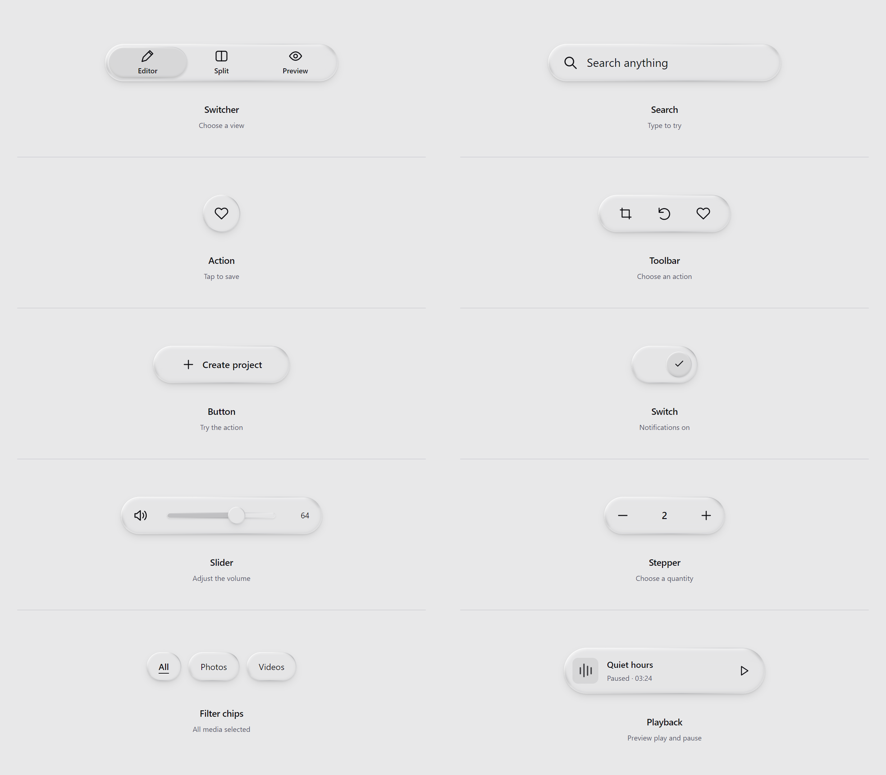

[Ver a coleção completa / View the full collection](docs/showcase/index.html?view=gallery) · [Tema escuro / Dark collection](docs/images/components-detail-dark.png) · [Comparação óptica 0%/100% / Optical comparison](liquid-glass-apple/assets/reference/article-comparison.png)

| Texto no playground / Text playground | Sobre uma fotografia / Over a photograph |
| :---: | :---: |
| [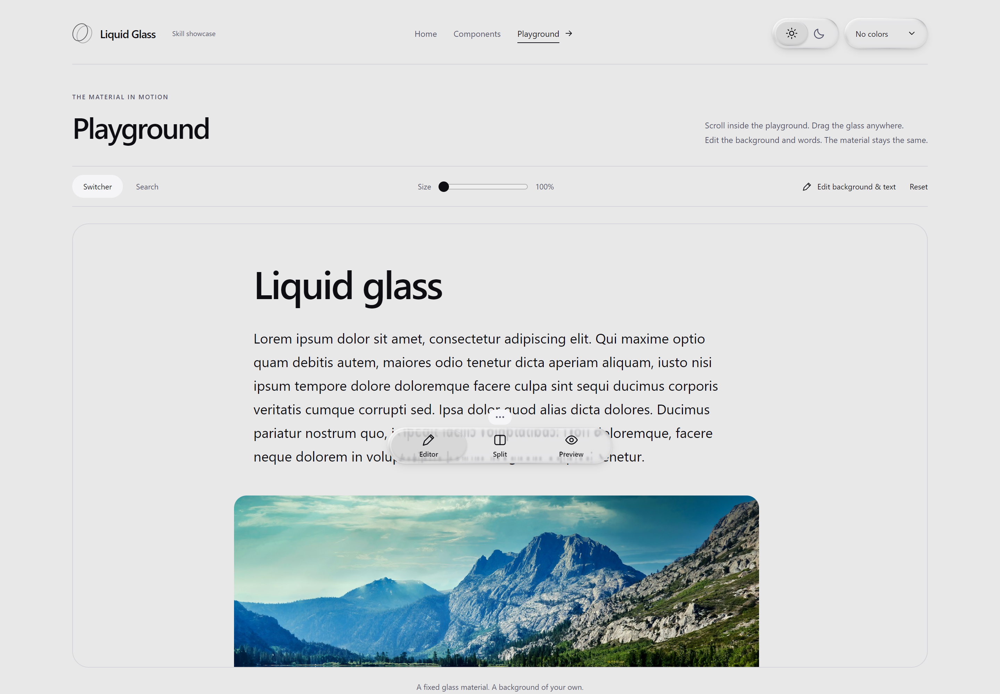](docs/images/playground-light.png) | [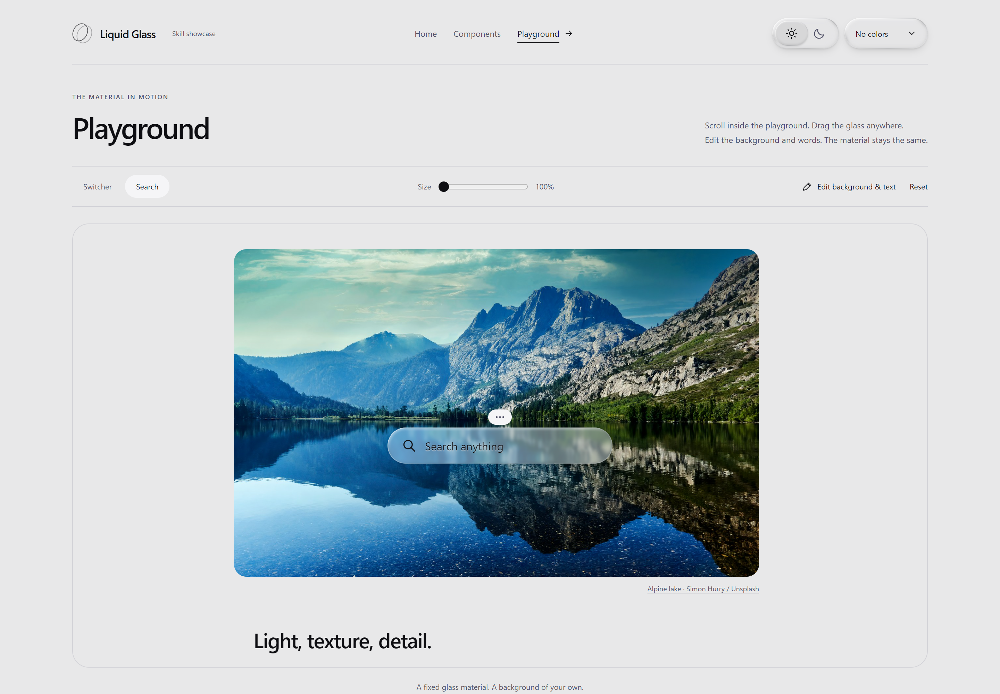](docs/images/playground-photo.png) |

O tema claro deixa mais da imagem atravessar o vidro, com menos camada cinza e atenuação separada do texto de fundo. A refração avança para dentro do ombro arredondado e acompanha o tamanho do componente. Em fundo uniforme, o volume vem de um reflexo contínuo pela curvatura da borda, com um limite fino e sombra exterior suave. Claro e escuro usam a mesma geometria, com intensidades próprias. Sobre branco puro, o interior continua quase branco. A coleção inicial mostra somente componentes; os testes com texto e fotografias ficam no playground.

Light glass lets more image detail through, with less gray tint and separate attenuation of background text. Refraction reaches into the rounded shoulder and follows the component's size. On uniform backgrounds, a continuous reflection across the curved shoulder provides volume, with a thin boundary and soft exterior shadow. Light and dark share the same geometry with theme-specific intensities. Over pure white, the interior stays nearly white. The collection shows only components; text and photography experiments belong to the playground.

O slider usa a mesma lente na barra e na bolinha. Ao segurar, a bolinha cresce discretamente; o input nativo preserva mouse, toque e teclado.

The slider uses the same lens on its track and thumb. Holding it slightly enlarges the thumb; a native input preserves mouse, touch, and keyboard controls.

| Claro / Light | Escuro / Dark |
| :---: | :---: |
| 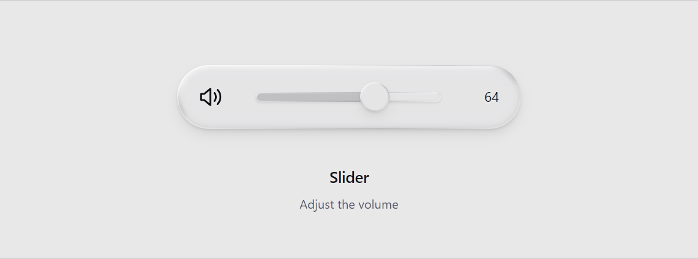 | 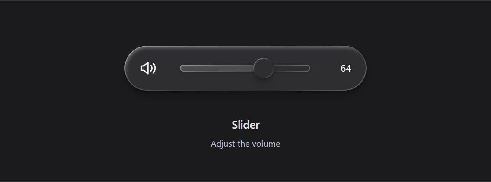 |

| Fotografia / Photograph | Fundo plano / Plain background |
| :---: | :---: |
| [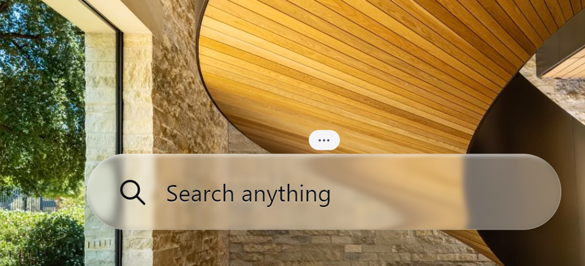](liquid-glass-apple/assets/reference/scaled-photo-light.png) | [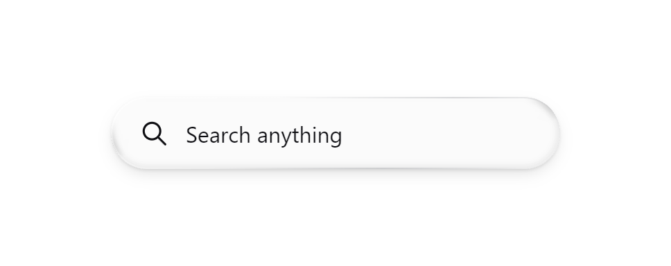](docs/images/material-empty-light.png) |
| [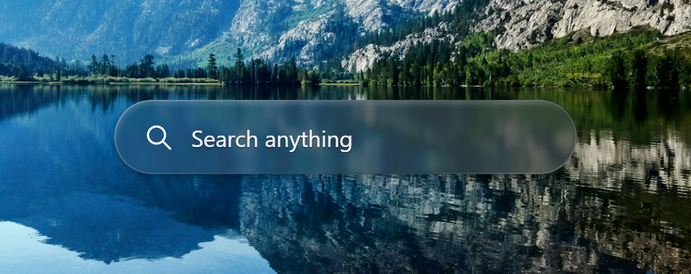](docs/images/material-photo-dark.png) | [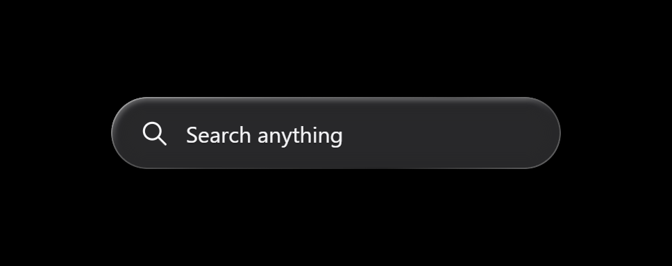](docs/images/material-empty-dark.png) |

## Com e sem cores / With and without colors

Capturas reais em **2×**, renderizadas pelo navegador. A geometria e a curva de refração são as mesmas nas quatro variantes. Clique para abrir em resolução completa.

Actual browser screenshots at **2×**. All four variants use the same geometry and refraction curve. Click to view full resolution.

| Sem cores / Neutral | Com cores / Colored |
| :---: | :---: |
| [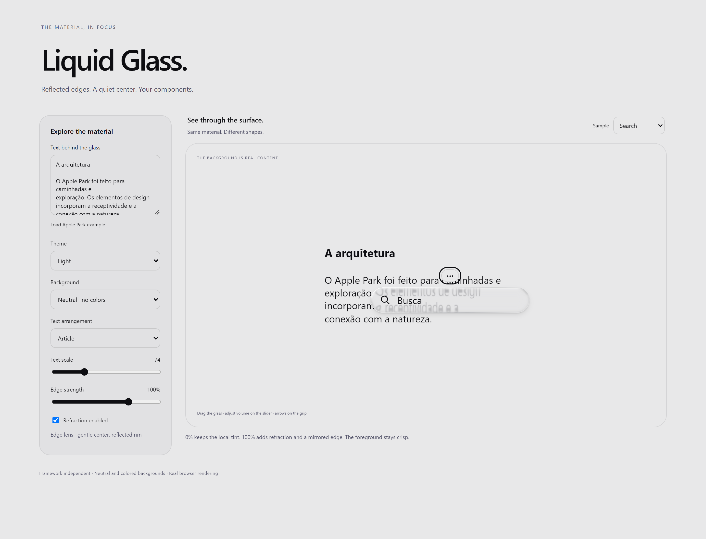](liquid-glass-apple/assets/reference/example-neutral-light.png) | [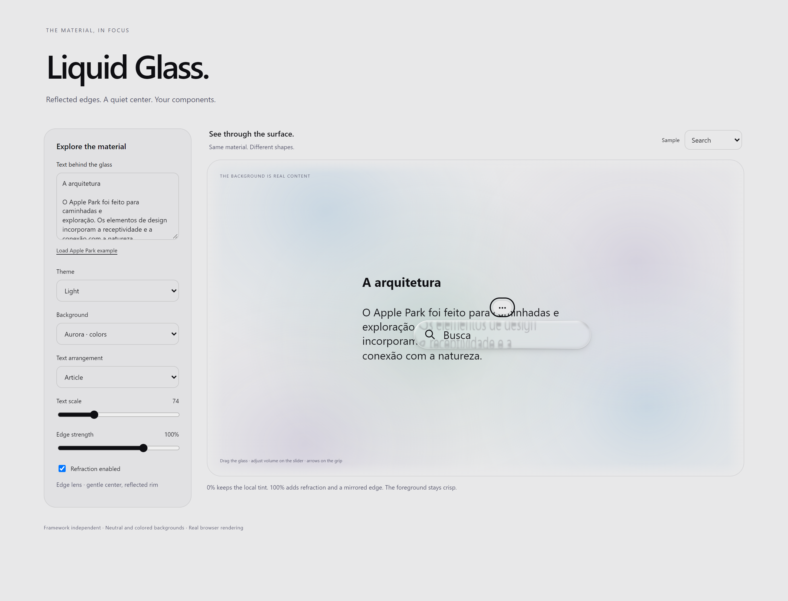](liquid-glass-apple/assets/reference/example-color-light.png) |
| [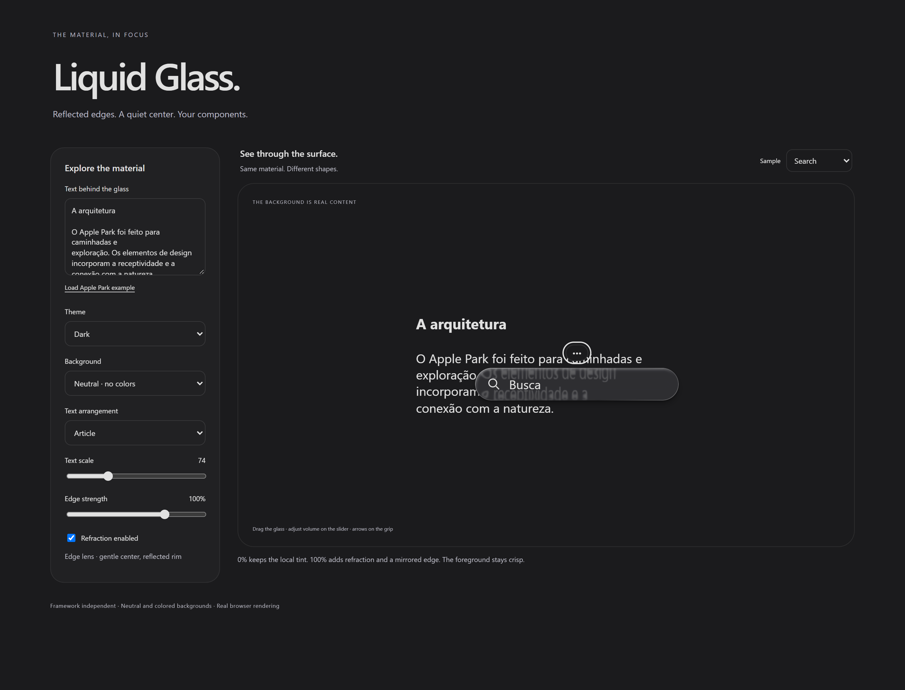](liquid-glass-apple/assets/reference/example-neutral-dark.png) | [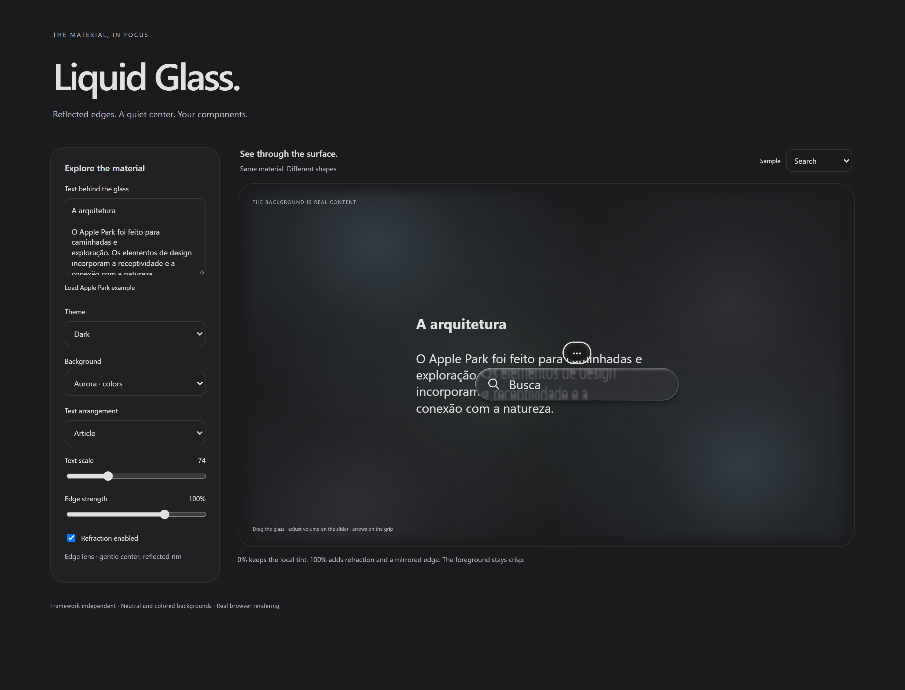](liquid-glass-apple/assets/reference/example-color-dark.png) |

## Português

### O que a skill faz

Aplica um material inspirado no Liquid Glass da Apple aos componentes necessários ao produto, preservando seu framework, layout, identidade e interações. Os exemplos ajudam a observar o vidro; não determinam quais componentes o agente deve criar.

**V1 · 1.0.0:** a [skill](liquid-glass-apple/SKILL.md) orienta a aplicação da receita Liquid Glass em qualquer projeto web, adaptando a integração ao framework, à arquitetura e aos componentes necessários. O núcleo portátil implementa a óptica calibrada. O [guia de componentes e estados](liquid-glass-apple/references/components.md) cobre menus translúcidos, seleções com acabamento em vidro e foco sem o retângulo nativo, preservando navegação por teclado.

- **Refração e espelhamento no contorno:** texto se alonga e se inverte perto das bordas, incluindo as laterais e os cantos.
- **Texto de fundo atenuado apenas sob o vidro:** glifos perdem contraste localmente; fotografias preservam suas cores e o conteúdo fora da superfície mantém a aparência original.
- **Centro com pouco blur:** letras do fundo continuam reconhecíveis; texto, ícones e campos do componente permanecem nítidos acima da lente.
- **Cores opcionais:** sempre inclui uma variante neutra e outra colorida, por opção de aparência, prop ou exemplos. Aurora, Ocean e Sunset são presets substituíveis.
- **Composição própria do projeto:** função, hierarquia, layout e identidade visual orientam a escolha e a disposição dos componentes.
- **Fallback acessível:** superfície sólida com transparência reduzida, contraste aumentado ou cores forçadas.

A receita principal vem do playground do **SKILLS**. A coleção reúne dez exemplos: seletor, busca, ação circular, barra de ícones, botão, switch, slider, controle de quantidade, filtros e reprodução, em um fundo simples. O artigo com texto e fotografias fica no playground. Todos usam a mesma curva de refração, com centro pouco borrado e acabamento claro/escuro.

### Instalar e usar

**Pelo Codex:** envie este pedido ao agente. O instalador busca a pasta correta na versão V1:

```text
Use $skill-installer para instalar a skill deste endereço:
https://github.com/HeitorMinuzzo/liquid-glass-skill/tree/v1.0.0/liquid-glass-apple
```

**Download manual:** baixe o [ZIP da V1](https://github.com/HeitorMinuzzo/liquid-glass-skill/releases/download/v1.0.0/liquid-glass-skill-v1.0.0.zip), extraia-o e copie a pasta completa `liquid-glass-apple` para o diretório de skills do seu agente. O ZIP contém apenas a skill, com seu núcleo, exemplo portátil, referências e licença; instalar a skill não requer Node.js nem Python.

Na descoberta local atual do Codex, a pasta pessoal é `~/.agents/skills/`; a pasta de um projeto é `.agents/skills/`. Se sua instalação usa outra pasta configurada, como `~/.codex/skills/`, use esse destino. Consulte a [documentação oficial de skills](https://learn.chatgpt.com/docs/build-skills).

No PowerShell, execute a partir da pasta extraída:

```powershell
New-Item -ItemType Directory -Force -Path "$env:USERPROFILE\.agents\skills" | Out-Null
Copy-Item -LiteralPath .\liquid-glass-apple -Destination "$env:USERPROFILE\.agents\skills" -Recurse
```

No macOS/Linux:

```sh
mkdir -p ~/.agents/skills
cp -R liquid-glass-apple ~/.agents/skills/
```

Para atualizar uma instalação antiga, faça backup da pasta anterior e substitua o pacote completo; apenas sobrepor arquivos pode manter recursos obsoletos. Evite instalar a mesma skill simultaneamente em vários destinos. O pacote é independente de `docs/`, `scripts/` e `node_modules/`. A skill fica disponível após a descoberta do agente; se não aparecer, reinicie o Codex.

Exemplo de pedido:

```text
Use $liquid-glass-apple nos controles desta aplicação.
Preserve o framework e os componentes existentes.
Inclua opções com fundo neutro e com cores.
```

### Experimentar o material

```sh
git clone https://github.com/HeitorMinuzzo/liquid-glass-skill.git
cd liquid-glass-skill
npm run showcase
```

Com Node.js 20 ou superior, o servidor abre em `http://127.0.0.1:4173`:

- [Apresentação da skill](http://127.0.0.1:4173/docs/showcase/index.html?view=home): uma apresentação curta e uma pequena vitrine com Search, Switcher e botão interativos, cada um com uma legenda discreta. O playground fica logo abaixo da vitrine, na mesma página. Autor: **Heitor Minuzzo**. Todos os componentes do site são exemplos criados utilizando a skill.
- [Playground do projeto](http://127.0.0.1:4173/docs/showcase/index.html?view=home#playground): uma caixa com rolagem própria para o artigo, lorem ipsum e fotografias. O componente começa centralizado nessa caixa e mantém sua posição enquanto o conteúdo passa por baixo, inclusive após ser arrastado. Ao rolar a Home, ele permanece preso ao mesmo ponto do playground. Arraste em qualquer parte do componente para movê-lo. A receita de vidro é fixa; não há ajustes de blur, reflexão ou refração.
- [Exemplo técnico portátil](http://127.0.0.1:4173/liquid-glass-apple/assets/example/index.html): amostras independentes para integrar a skill, com comparação óptica para desenvolvimento.
- [Coleção de componentes](http://127.0.0.1:4173/docs/showcase/index.html?view=gallery): dez amostras compactas e interativas com a mesma lente do playground.

No playground, **Edit background & text** abre a edição de título, texto e cores do fundo. Você pode ocultar, embaralhar ou substituir as fotografias por uma imagem local. **Size** aumenta o componente de 100% a 200%, recalculando a mesma receita para sua geometria. Um clique parado continua funcionando; arrastar sobre um campo mantém seu valor. A alça também aceita setas do teclado e Home para reposicionar.

Sirva o exemplo por HTTP; módulos ES não devem ser abertos diretamente por `file://`.

### Integrar no seu projeto

Copie o CSS e o JS de [`assets/core/`](liquid-glass-apple/assets/core/). O módulo não tem dependências de runtime. Ele recebe uma fonte apresentacional controlada do cenário, como texto, gradientes e imagens estáticas:

```js
import { createGlassScene } from './liquid-glass.js';

const scene = createGlassScene({ stage, source: backgroundContent, themeRoot });
const glass = scene.add(materialElement, { strength: 1 });

stage.dataset.glassBackdrop = 'none';   // sem cores
stage.dataset.glassBackdrop = 'aurora'; // com cores

scene.refresh();    // após mover o componente
scene.destroy();    // ao desmontar
```

Use camadas separadas para `.glass-material`, `.glass-content` e `.glass-rim` dentro de `.liquid-glass`. Defina a forma e o layout conforme a função do componente. A [integração completa](liquid-glass-apple/references/integration.md) explica a estrutura HTML, múltiplas superfícies, renderer customizado e ciclo de vida em outros frameworks.

A lente não captura um DOM arbitrário: sincroniza um cenário conhecido. Para outro renderer, adapte a fonte de pixels; o fallback CSS mantém o uso, mas não reproduz o espelhamento. A implementação foi verificada em Chromium/Edge; Safari/iPhone precisa de avaliação no dispositivo. É uma aproximação web, sem promessa de paridade com o renderer nativo da Apple.

### Verificar e regenerar capturas

```sh
npm ci
npx playwright install chromium
npm run verify:package
npm run verify:lens
npm run screenshots
npm run screenshots:reference
```

`verify:package` testa o exemplo técnico portátil, suas variantes e a desmontagem. `verify:lens` mede refração, contraste, nitidez e composição da máscara em um fixture separado da interface pública. `screenshots` verifica o alinhamento durante a rolagem do artigo, edição de texto/imagens, arraste sobre controles, material fixo, fallback e layouts de 320 a 1440px; também atualiza as capturas do site em 2×. A variável opcional `SHOWCASE_BROWSER` permite usar um executável Chromium/Edge existente.

### Empacotar uma versão

Com Python 3 disponível, `npm run package:skill` gera `dist/liquid-glass-skill-v1.0.0.zip` e `dist/SHA256SUMS.txt`. O script verifica o inventário e o conteúdo de cada arquivo do pacote. A pasta `dist/` fica fora do Git; os arquivos são distribuídos como assets da release. A captura principal escolhida pelo autor é preservada na regeneração das referências.

## English

### What the skill does

Applies an Apple Liquid Glass inspired material to the components your product needs, preserving its framework, layout, identity, and interactions. The examples demonstrate the material; they do not dictate the components an agent must build.

**V1 · 1.0.0:** the [skill](liquid-glass-apple/SKILL.md) guides application of the Liquid Glass recipe to any web project, adapting integration to its framework, architecture, and required components. The portable core implements the calibrated optics. The [component and state guide](liquid-glass-apple/references/components.md) covers translucent menus, glass selection finishes, and focus without the native rectangle while preserving keyboard navigation.

- **Refraction and a mirrored rim:** background text stretches and reverses near the contour, including the sides and corners.
- **Local text contrast reduction:** background glyphs lose contrast beneath the glass; photographs keep their colors and uncovered content keeps its original appearance.
- **Little blur in the center:** background letters remain recognizable; foreground text, icons, and inputs stay sharp above the lens.
- **Optional colors:** always includes neutral and colored variants through appearance settings, props, or examples. Aurora, Ocean, and Sunset are replaceable presets.
- **Project-specific composition:** function, hierarchy, layout, and visual identity guide component selection and placement.
- **Accessible fallback:** solid surfaces for reduced transparency, increased contrast, or forced colors.

The primary recipe comes from the **SKILLS** playground. The collection includes ten examples: a segmented control, search, circular action, icon toolbar, button, switch, slider, stepper, filter chips, and playback control on a simple background. Text and photography belong to the article playground. All use the same refraction curve, with a gently blurred center and light/dark finishes.

### Install and invoke

**From Codex:** send this prompt to your agent. The installer selects the skill folder from the V1 release:

```text
Use $skill-installer to install the skill at:
https://github.com/HeitorMinuzzo/liquid-glass-skill/tree/v1.0.0/liquid-glass-apple
```

**Manual download:** download the [V1 ZIP](https://github.com/HeitorMinuzzo/liquid-glass-skill/releases/download/v1.0.0/liquid-glass-skill-v1.0.0.zip), extract it, and copy the complete `liquid-glass-apple` folder into your agent's skills directory. The ZIP contains only the skill, including its core, portable example, references, and license; installing the skill does not require Node.js or Python.

Current Codex local discovery uses `~/.agents/skills/` for personal skills and `.agents/skills/` for a project. If your installation uses another configured location, such as `~/.codex/skills/`, use that destination. See the [official skills documentation](https://learn.chatgpt.com/docs/build-skills).

In PowerShell, run from the extracted directory:

```powershell
New-Item -ItemType Directory -Force -Path "$env:USERPROFILE\.agents\skills" | Out-Null
Copy-Item -LiteralPath .\liquid-glass-apple -Destination "$env:USERPROFILE\.agents\skills" -Recurse
```

On macOS/Linux:

```sh
mkdir -p ~/.agents/skills
cp -R liquid-glass-apple ~/.agents/skills/
```

When updating an older installation, back it up and replace the complete package; overlaying files can leave obsolete resources behind. Avoid installing the same skill in multiple locations at once. The package does not depend on `docs/`, `scripts/`, or `node_modules/`. Your agent discovers the new skill; if it does not appear, restart Codex.

Example prompt:

```text
Use $liquid-glass-apple on this application's controls.
Preserve the framework and existing components.
Include neutral and colored background options.
```

### Explore the material

```sh
git clone https://github.com/HeitorMinuzzo/liquid-glass-skill.git
cd liquid-glass-skill
npm run showcase
```

With Node.js 20 or later, the server runs at `http://127.0.0.1:4173`:

- [Skill introduction](http://127.0.0.1:4173/docs/showcase/index.html?view=home): a short introduction and a small showcase with interactive Search, Switcher, and button examples, each with a discreet caption. The playground sits directly below the showcase on the same page. Author: **Heitor Minuzzo**. Every component on the site is an example created using the skill.
- [Project playground](http://127.0.0.1:4173/docs/showcase/index.html?view=home#playground): a frame with its own scroll area for the article, lorem ipsum, and photographs. The component starts centered in this frame and keeps its position while the content passes underneath, including after it is dragged. Scrolling Home leaves it attached to the same point in the playground. Drag anywhere on the component to move it. The glass recipe is fixed, with no blur, reflection, or refraction settings.
- [Portable technical example](http://127.0.0.1:4173/liquid-glass-apple/assets/example/index.html): independent samples for skill integration, with optical comparisons for development.
- [Component collection](http://127.0.0.1:4173/docs/showcase/index.html?view=gallery): ten compact, interactive samples using the same lens as the playground.

In the playground, **Edit background & text** opens the title, article text, and background colors. Hide, shuffle, or replace the photographs with a local image. **Size** enlarges the component from 100% to 200%, recalculating the same recipe for its geometry. Stationary clicks still work; dragging across an input preserves its value. The grip also accepts keyboard arrows and Home to reposition.

Serve the example over HTTP; do not open ES modules directly through `file://`.

### Integrate into your project

Copy the CSS and JS from [`assets/core/`](liquid-glass-apple/assets/core/). The module has no runtime dependencies. It receives a controlled, presentational background source such as text, gradients, and static images:

```js
import { createGlassScene } from './liquid-glass.js';

const scene = createGlassScene({ stage, source: backgroundContent, themeRoot });
const glass = scene.add(materialElement, { strength: 1 });

stage.dataset.glassBackdrop = 'none';   // neutral
stage.dataset.glassBackdrop = 'aurora'; // colored

scene.refresh();    // after moving the component
scene.destroy();    // on unmount
```

Place separate `.glass-material`, `.glass-content`, and `.glass-rim` layers inside `.liquid-glass`. Choose the shape and layout for the component's function. The [integration reference](liquid-glass-apple/references/integration.md) covers HTML structure, multiple surfaces, a custom renderer, and framework lifecycle integration. The skill instructions and detailed references are in Portuguese.

The lens synchronizes a known scene rather than capturing arbitrary DOM content. Adapt the pixel source for other renderers; the CSS fallback preserves usability but does not reproduce the mirrored rim. Rendering was verified in Chromium/Edge; Safari/iPhone requires device testing. This is a web approximation, without a claim of parity with Apple's native renderer.

### Verify and regenerate screenshots

```sh
npm ci
npx playwright install chromium
npm run verify:package
npm run verify:lens
npm run screenshots
npm run screenshots:reference
```

`verify:package` checks the portable technical example, its variants, and cleanup. `verify:lens` measures refraction, contrast, sharpness, and mask composition in a fixture separate from the public interface. `screenshots` verifies alignment during article scrolling, text/image editing, dragging over controls, fixed material, fallback, and layouts from 320 to 1440px; it also updates site captures at 2×. The optional `SHOWCASE_BROWSER` environment variable selects an existing Chromium/Edge executable.

### Package a release

With Python 3 available, `npm run package:skill` creates `dist/liquid-glass-skill-v1.0.0.zip` and `dist/SHA256SUMS.txt`. The script checks the inventory and contents of every packaged file. `dist/` stays outside Git; these files are distributed as release assets. Regenerating the references preserves the author's selected photo capture.

## Estrutura / Structure

```text
liquid-glass-apple/       ← pacote completo para instalar / complete installable skill
  SKILL.md                 instruções centradas no material / material-focused guidance
  agents/openai.yaml       metadados / metadata
  assets/core/             CSS, ES module e tipos / CSS, ES module, and types
  assets/example/          exemplo portátil / portable example
  assets/reference/        capturas atuais / current screenshots
  assets/source-license.txt
  references/              material, integration, components, motion, validation, origin

docs/showcase/           ← coleção de componentes e playground / component collection and playground
scripts/                 ← servidor, verificações e capturas / server, checks, and captures
```

O playground e a skill importam o **mesmo módulo óptico**, evitando receitas divergentes.

The playground and the skill import the **same optical module**, keeping the recipe consistent.

## Licença e créditos / License and credits

[AGPL-3.0-only](LICENSE). A licença do código de origem também acompanha a skill em [source-license.txt](liquid-glass-apple/assets/source-license.txt). O histórico do LowNotes e a atribuição ao material de Vadik Matveev foram preservados em [avisos de procedência](THIRD_PARTY_NOTICES.md) e [origem da skill](liquid-glass-apple/references/origin.md).

[AGPL-3.0-only](LICENSE). The original code license is also bundled with the skill as [source-license.txt](liquid-glass-apple/assets/source-license.txt). LowNotes history and attribution to Vadik Matveev's material are preserved in the [provenance notices](THIRD_PARTY_NOTICES.md) and [skill origin](liquid-glass-apple/references/origin.md).

As fotos de exemplo estão incluídas localmente em `docs/showcase/assets/`, com [autores e fontes](docs/showcase/assets/photos.json) e termos separados do código em [avisos de procedência](THIRD_PARTY_NOTICES.md). Nenhuma requisição a serviços de imagens é necessária durante o uso.

Sample photographs are bundled locally in `docs/showcase/assets/`, with [authors and sources](docs/showcase/assets/photos.json) and terms separate from the code in the [provenance notices](THIRD_PARTY_NOTICES.md). No external image service request is needed during use.

Projeto independente, sem vínculo ou patrocínio da Apple. As imagens demonstram código deste projeto e não incluem os prints de referência do iPhone.

An independent project, not affiliated with or sponsored by Apple. The images demonstrate this project's code and do not include the iPhone reference screenshots.
